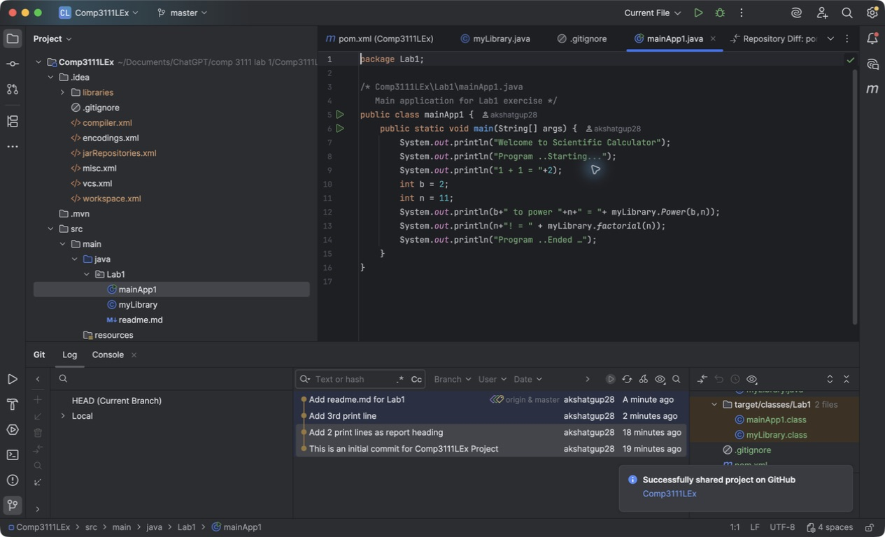

# COMP3111 Lab 1

This Maven project was created in IntelliJ IDEA using Java 21.
`myLibrary.java` provides the power and factorial functions used by `mainApp1.java`.

The lab covers building and running the project, correcting a compiler error, committing changes with Git, and pushing them to GitHub.

